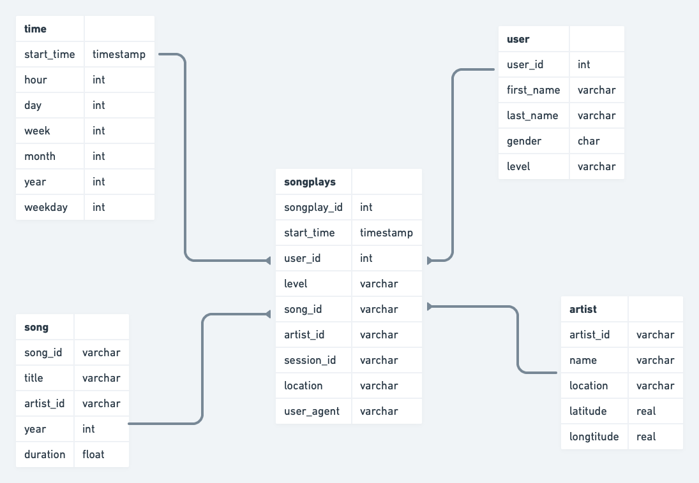

# Data Engineering Project 5: Data Pipelines

## Context

A music streaming company, Sparkify, has decided that it is time to introduce more automation and monitoring to their data warehouse ETL pipelines. This Airflow DAG will allow the company to load a song and log data from S3, store it into staging tables on AWS Redshift and transform it into fact and dimension tables.

To make sure the loaded data is of good quality, a data quality operator in Airflow will guarantee the loaded data meets the pre-defined standards.

## Sparkify DAG Process Steps


### stage_redshift operator

This operator will load song and log data from S3 given the bucket and key as input parameters. The operator also requires the create statement and table name as input parameters.The staging tables are created if not already existing, or else the existing table is truncated.

### load_fact operator

Here we will create the fact table based on the data found in the staging tables. The fact data is appended to this table. 

### load_dimensions operator

This operator will create the dimension tables based on the staging tables and fact table. The input for this operator is the destination table name and the truncate table parameter, and this must be set to True if the table needs to be truncated before loading data. Finally, the query to create the dimension table is also needed.

### data_quality operator

This operator is used to run checks on the data itself. The operator's main functionality is to receive one or more SQL based test cases along with the expected results and execute the tests. For each test, the test result and the desired outcome needs to be checked, and if there is no match, the operator will raise an exception and the task will fail.

### Fact & Dimension table ERD



## Using the DAG

Requirements: 

- Airflow version 2.1.2 or greater
- Python version 3.7 or greater
- Access to an AWS Redshift Cluster with S3 read access
- AWS credentials for reading S3 storage

Steps:

1. Modify the sparkify-pipeline.py in the dags direcory
2. Create the tables using the queries below
3. Run the dag using Airlfow
4. Enjoy the results!

### Create table statements

```sql
CREATE TABLE IF NOT EXISTS staging_events (
    artist varchar,
    auth varchar,
    firstName varchar,
    gender char,
    itemInSession int,
    lastName varchar,
    length varchar,
    level varchar,
    location varchar,
    method varchar,
    page varchar,
    registration bigint,
    sessionId int,
    song varchar,
    status int,
    ts varchar,
    userAgent varchar,
    userId int
    )
    
 CREATE TABLE IF NOT EXISTS staging_songs (
    artist_id varchar,
    artist_latitude float,
    artist_location varchar,
    artist_longitude float,
    artist_name varchar,
    duration float,
    num_songs int,
    song_id varchar,
    title varchar,
    year int
    )
    
CREATE TABLE IF NOT EXISTS songplays (
		songplay_id varchar,
		start_time timestamp,
  	user_id int,
  	level varchar,
  	song_id varchar,
  	artist_id varchar,
  	sessionid varchar,
  	location varchar,
  	useragent varchar
)

CREATE TABLE IF NOT EXISTS users (
		userid int,
  	firstname varchar,
  	lastname varchar,
  	gender char,
  	level varchar
)

CREATE TABLE IF NOT EXISTS songs (
		song_id varchar,
  	title varchar,
  	artist_id varchar,
  	year int,
  	duration float
)

CREATE TABLE IF NOT EXISTS artists (
		artist_id varchar,
  	artist_name varchar,
  	artist_location varchar,
  	artist_latitude real,
  	artist_longitude real
)

CREATE TABLE IF NOT EXISTS time (
		start_time timestamp,
  	hour int,
  	day int,
  	week int,
  	month int,
  	year int,
  	dayofweek int
)
```

